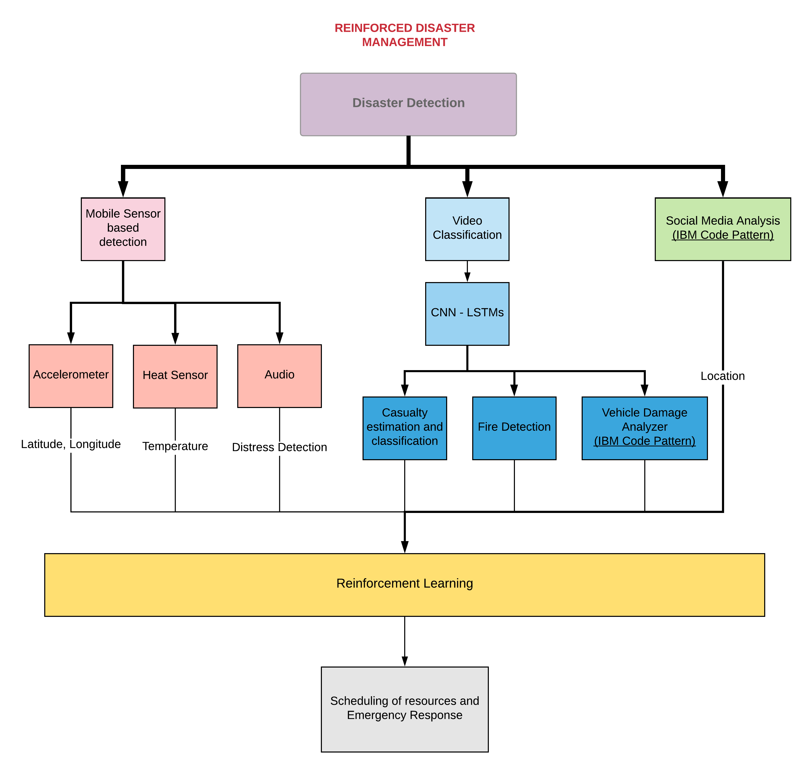

# Reinforced Roads

A reinforcement based emergency response system that optimises lives saved and time taken to save lives.

---
Steps:
- pip3 install -r requirements.txt
- python3 Server/manage.py runserver
---

---
 
